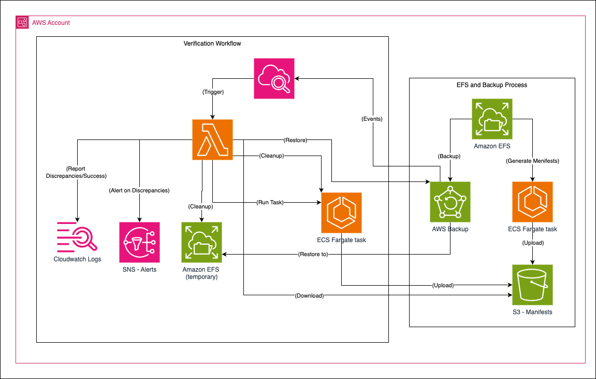
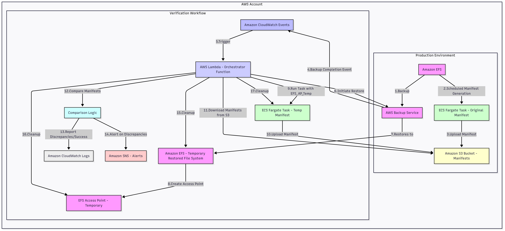

# EFS Backup Consistency Verification Solution

## Table of Contents
* [Introduction](#1-introduction)
* [Problem](#2-problem)
* [Thought Process Behind the Solution](#3-my-thought-process-behind-the-solution)
* [Folder Structure](#4-folder-structure)
* [Architecture & Flow Diagram](#5-architecture--flow-diagram)
* [Deployment and Configuration Guide](#6-deployment-and-configuration-guide)
    * [Prerequisites](#prerequisites)
    * [Step 1: Prepare the Manifest Generator Docker Image](#step-1-prepare-the-manifest-generator-docker-image)
    * [Step 2: Configure Terraform Variables](#step-2-configure-terraform-variables)
    * [Step 3: Deploy Infrastructure with Terraform](#step-3-deploy-infrastructure-with-terraform)
    * [Step 4: Verify Deployment](#step-4-verify-deployment)
    * [Step 5: Configure AWS Backup](#step-5-configure-aws-backup)
    * [Step 6: Subscribe to SNS Alerts](#step-6-subscribe-to-sns-alerts)
* [Sentinel Policies](#7-sentinel-policies)
* [Cleanup](#8-cleanup)

## 1. Introduction

This repository contains the infrastructure and code for an automated solution designed to verify the consistency of Amazon Elastic File System (EFS) backups. It addresses the challenge of ensuring data integrity when EFS file systems are actively modified during AWS Backup operations.

## 2. Problem

AWS Backup for Amazon EFS is a robust service that captures ongoing changes in the file system. However, a known challenge arises when the EFS file system is actively modified during the backup window. While AWS Backup aims for point-in-time consistency, there's a potential for inconsistencies if files are changed precisely at the moment they are being backed up.

For applications heavily reliant on EFS, where continuous file modifications cannot be halted or guaranteed to be static during backup periods, this potential for inconsistency becomes a critical concern. A standard backup might complete successfully, but without an explicit verification step, there's no guarantee that the restored data will precisely match the state of the EFS at the intended backup point, especially for files undergoing active writes.

This solution aims to bridge that gap by providing a mechanism to programmatically verify that a restored EFS backup contains the same files and contents as the original EFS file system at a specific point in time, thereby ensuring data integrity and peace of mind.

## 3. My Thought Process Behind the Solution

The core challenge is to compare two states of a file system: the EFS at a "backup start" point and the restored EFS from that backup. Simply comparing file counts or sizes isn't sufficient; deep content verification is required.

My thought process led to the following key design decisions:
- **Manifest-Based Comparison:** The most reliable way to compare file system states is by generating a "manifest" for each. This manifest should include not just file paths and sizes, but critically, a cryptographic hash (SHA256) of each file's content. This allows for byte-for-byte content verification.
- **Pre-Backup "Ground Truth" Manifest:** To establish a reliable baseline, a manifest of the EFS must be generated before the AWS Backup process begins. This manifest represents the "truth" against which the restored backup will be compared. We chose a scheduled ECS Fargate task for this to ensure a serverless, scalable, and automated approach without managing dedicated EC2 instances.
- **Temporary Backup Restoration:** To avoid impacting the EFS, the backup must be restored to a new, temporary EFS file system. This isolation is crucial for non-disruptive verification.
- **Post-Restore Manifest Generation:** After the backup is restored to the temporary EFS, another manifest of this restored file system is generated. Again, ECS Fargate is ideal here, spun up on-demand by the orchestrator.
- **Centralized Orchestration (Lambda):** An AWS Lambda function serves as the central brain. It's triggered by AWS Backup completion events, orchestrates the EFS restore, launches the Fargate task for the restored EFS manifest, downloads both manifests from S3, performs the comparison, and reports discrepancies. Lambda is chosen for its serverless nature, event-driven capabilities, and cost-effectiveness for intermittent tasks.
- **ECS Fargate for Manifest Generation:** Instead of traditional EC2 instances, ECS Fargate offers several advantages:
    - **Serverless Compute:** No servers to provision, patch, or scale. AWS manages the underlying infrastructure.
    - **On-Demand Scaling:** Tasks can be launched quickly and terminated immediately after completion, optimizing costs.
    - **EFS Integration:** Fargate tasks can directly mount EFS file systems using EFS Access Points, simplifying file access within the container.
    - **Containerization:** The manifest generation logic is encapsulated in a Docker image, ensuring consistent execution environments.
- **S3 for Manifest Storage:** Amazon S3 provides highly durable, scalable, and cost-effective storage for the manifest files. It's easily accessible by both Fargate tasks and Lambda functions.
- **Automated Triggering (CloudWatch Events):** Integrating with AWS Backup's CloudWatch Events allows the entire verification process to be automatically triggered upon successful backup completion, ensuring continuous monitoring without manual intervention.
- **Alerting (SNS):** For immediate notification of any detected inconsistencies or process failures, Amazon SNS is used to send alerts to subscribed personnel.
- **Automated Cleanup:** To manage costs and resource sprawl, all temporary resources (restored EFS, EFS Access Points, Fargate tasks) are automatically terminated and deleted after the verification process is complete.
- **Infrastructure as Code (Terraform):** Terraform is used to define and manage the entire infrastructure. This provides:
    - **Reproducibility:** Easily recreate the environment.
    - **Version Control:** Track infrastructure changes.
    - **Modularity:** Break down the solution into manageable, reusable components (S3, IAM, Lambda, ECS).
    - **Automation:** Automate deployment and updates.
- **Security Validation (Sentinel):** HashiCorp Sentinel policies are integrated to enforce security best practices and compliance checks on the Terraform-deployed infrastructure, ensuring that the deployed resources meet organizational standards for encryption, least privilege, network configuration, and resource limits.

## 4. Folder Structure

```text
.
├── main.tf
├── variables.tf
├── outputs.tf
├── modules/
│   ├── s3_bucket/
│   │   ├── main.tf
│   │   ├── variables.tf
│   │   └── outputs.tf
│   ├── iam/
│   │   ├── main.tf
│   │   ├── variables.tf
│   │   └── outputs.tf
│   ├── lambda/
│   │   ├── lambda_package.py
│   │   ├── lambda_package.zip
│   │   ├── main.tf
│   │   ├── variables.tf
│   │   └── outputs.tf
│   ├── ecs_manifest_generator/
│   │   ├── main.tf
│   │   ├── variables.tf
│   │   └── outputs.tf
├── scripts/
│   ├── efs_manifest_generator.py
│   └── Dockerfile # NEW: For building your Fargate image
└── sentinel/
    |── s3-encryption.sentinel
    |── iam-least-privilege.sentinel
    |── lambda-vpc.sentinel 
    └── ecs-fargate-limits.sentinel
```

## 5. Architecture & Flow Diagram

The solution comprises several AWS services working together to automate the EFS backup consistency verification process.



### Workflow



**Workflow Explanation:**
1. **EFS Backup:** Existing AWS Backup job takes a snapshot of your EFS.
2. **Original Manifest Generation:** A scheduled ECS Fargate task (using the ecs_manifest_generator module) mounts the EFS via an EFS Access Point and generates a manifest (file paths, sizes, SHA256 hashes).
3. **Manifest Upload:** This "ground truth" manifest is uploaded to a dedicated S3 bucket.
4. **Backup Completion Event:** Upon successful completion of the AWS Backup job for EFS, a CloudWatch Event is triggered.
5. **Lambda Orchestrator Invocation:** The CloudWatch Event invokes the EFS Orchestrator Lambda function.
6. **EFS Restore Initiation:** The Lambda function initiates a restore job for the latest EFS recovery point from AWS Backup.
7. **Temporary EFS Creation:** AWS Backup restores the EFS data to a new, temporary EFS file system.
8. **Temporary EFS Access Point:** The Lambda creates an EFS Access Point for this temporary EFS, enabling Fargate access.
9. **Temporary Manifest Generation:** The Lambda launches another ECS Fargate task (using the same ecs_manifest_generator task definition) to mount the temporary EFS via its Access Point and generate a manifest of the restored data.
10. **Manifest Upload:** This "restored backup" manifest is also uploaded to the S3 bucket.
11. **Manifest Comparison:** The Lambda downloads both the "original" and "restored" manifests from S3.
12. **Comparison Logic:** The Lambda's internal logic compares the two manifests, identifying discrepancies in file presence, size, or content hashes.
13. **Logging:** Comparison results (success or discrepancies) are logged to CloudWatch Logs.
14. **Alerting:** If discrepancies are found, an alert is published to an SNS topic, notifying relevant personnel.
15. **Cleanup:** Finally, the Lambda function cleans up all temporary resources, including the temporary EFS file system, its mount targets/access points, and any running ECS Fargate tasks.

## 6. Deployment and Configuration Guide

This guide provides step-by-step instructions to deploy and configure the EFS backup consistency verification solution in a AWS account using Terraform.

### Prerequisites

- AWS Account: An active AWS account with appropriate permissions to create IAM roles, S3 buckets, Lambda functions, ECS clusters, EFS file systems, and CloudWatch resources.
- Terraform: Install Terraform (v1.0+ recommended).
- AWS CLI: Configure your AWS CLI with credentials for your target account and region.
- Docker: Install Docker to build and push the manifest generator image.
- ECR Repository: Create an Amazon Elastic Container Registry (ECR) repository in your AWS account to store the Docker image for the manifest generator.
    - Example: 
        ```bash
        aws ecr create-repository --repository-name efs-manifest-generator --region <your-region>
        ```
- Existing EFS File System: You must have an existing Amazon EFS file system that you are backing up with AWS Backup. Note its File System ID (`fs-xxxxxxxxxxxxxxxxx`).
- VPC, Subnets, Security Groups: Identify the VPC, private subnets (at least two for high availability), and security groups where your Lambda and ECS Fargate tasks will operate. The security group(s) must allow outbound access to S3, EFS, and ECR. EFS mount targets require specific inbound rules (NFS port 2049) from the security groups used by your Lambda and ECS Fargate tasks.

### Step 1: Prepare the Manifest Generator Docker Image

The `efs_manifest_generator.py` script needs to be packaged into a Docker image and pushed to ECR.

1. Navigate to the `scripts/` directory:
    ```bash
    cd path/to/your/project/scripts
    ```
2. Create `Dockerfile:` (I have already provided the sample)
3. Build the Docker image: Replace `<account-id>`, `<region>`, and `<ecr-repo-name>` with your actual values.
    ```bash
    docker build -t <account-id>.dkr.ecr.<region>.amazonaws.com/<ecr-repo-name>:latest .
    ```
4. Authenticate Docker to ECR:
    ```bash
    aws ecr get-login-password --region <region> | docker login --username AWS --password-stdin <account-id>.dkr.ecr.<region>.amazonaws.com
    ```
5. Push the Docker image to ECR:
    ```bash
    docker push <account-id>.dkr.ecr.<region>.amazonaws.com/<ecr-repo-name>:latest
    ```

    Make a note of the full ECR Image URI (e.g., `123456789012.dkr.ecr.us-east-1.amazonaws.com/efs-manifest-repo:latest`) and the ECR Repository ARN (e.g., `arn:aws:ecr:us-east-1:123456789012:repository/efs-manifest-repo`). You'll need these for Terraform variables.

### Step 2: Configure Terraform Variables

1. Edit `variables.tf` in the root directory: Update the default values or provide them via `terraform.tfvars` or environment variables.
    ```terraform
    # variables.tf (root module)
    variable "aws_region" {
        description = "The AWS region to deploy resources in."
        type        = string
        default     = "us-east-1" # <--- YOUR REGION
    }

    variable "project_name" {
        description = "A unique name for the project, used as a prefix for resources."
        type        = string
        default     = "efs-backup-verifier"
    }

    variable "efs_id" {
        description = "The ID of your production EFS file system to be backed up and verified."
        type        = string
        # Example: default = "fs-xxxxxxxxxxxxxxxxx" # <--- YOUR EFS ID
    }

    variable "s3_bucket_name" {
        description = "Name for the S3 bucket to store EFS manifests. Must be globally unique."
        type        = string
        # Example: default = "my-efs-backup-manifests-12345" # <--- GLOBALLY UNIQUE BUCKET NAME
    }

    variable "vpc_id" {
        description = "The ID of the VPC where resources will be deployed."
        type        = string
        # Example: default = "vpc-xxxxxxxxxxxxxxxxx" # <--- YOUR VPC ID
    }

    variable "subnet_ids" {
        description = "A list of subnet IDs for Lambda and ECS deployment."
        type        = list(string)
        # Example: default = ["subnet-xxxxxxxxxxxxxxxxx", "subnet-yyyyyyyyyyyyyyyyy"] # <--- YOUR PRIVATE SUBNET IDs
    }

    variable "security_group_ids" {
        description = "A list of security group IDs for Lambda and ECS."
        type        = list(string)
        # Example: default = ["sg-xxxxxxxxxxxxxxxxx"] # <--- YOUR SECURITY GROUP IDs
    }

    variable "ecr_repository_arn" {
        description = "The ARN of the ECR repository containing the manifest generator Docker image."
        type        = string
        # Example: default = "arn:aws:ecr:us-east-1:123456789012:repository/your-ecr-repo" # <--- YOUR ECR REPO ARN
    }

    variable "ecr_image_uri" {
        description = "The URI of the Docker image for the manifest generator (e.g., your-ecr-repo/efs-manifest-generator:latest)."
        type        = string
        # Example: default = "123456789012.dkr.ecr.us-east-1.amazonaws.com/your-ecr-repo:latest" # <--- YOUR ECR IMAGE URI
    }
    ```

### Step 3: Deploy Infrastructure with Terraform

1. Initialize Terraform: Navigate to the root of your Terraform project (where main.tf is located) and run:
    ```bash
    terraform init
    ```
2. Plan the deployment: This will show you what resources Terraform will create.
    ```bash
    terraform plan
    ```
3. Apply the changes: If the plan looks correct, proceed with the deployment.
    ```bash
    terraform apply
    ```
    Type `yes` when prompted to confirm.

### Step 4: Verify Deployment

After `terraform apply` completes successfully, verify the following:
- S3 Bucket: Check the AWS S3 console for your created manifest bucket.
- IAM Roles: Confirm the creation of efs-backup-verifier-ecs-task-execution-role, efs-backup-verifier-ecs-task-role, and efs-backup-verifier-orchestrator-lambda-role in the IAM console.
- Lambda Function: Verify the efs-backup-verifier-orchestrator-lambda function exists in the Lambda console.
- ECS Cluster: Check the efs-backup-verifier-manifest-cluster in the ECS console.
- ECS Task Definition: Confirm the efs-backup-verifier-manifest-task task definition exists.
- CloudWatch Event Rule: Look for efs-backup-verifier-backup-completion-rule and efs-backup-verifier-original-manifest-schedule in the CloudWatch console under "Events" -> "Rules".
- SNS Topic: Find efs-backup-verifier-consistency-alerts in the SNS console.

### Step 5: Configure AWS Backup

Ensure AWS Backup plan is configured to back up the target EFS file system. The CloudWatch Event rule will automatically trigger the Lambda when an EFS backup job completes.

### Step 6: Subscribe to SNS Alerts

To receive notifications about consistency check results (especially discrepancies), subscribe an email address or other endpoint to the SNS topic created by Terraform.

1. Go to the Amazon SNS console.
2. Find the topic named efs-backup-verifier-consistency-alerts.
3. Click on the topic and then click "Create subscription".
4. Choose "Email" as the protocol and enter your email address.
5. Confirm the subscription via the email you receive.

## 7. Sentinel Policies

The solution integrates HashiCorp Sentinel policies for continuous security and compliance validation. These policies are designed to enforce best practices for the deployed AWS resources.
- `s3_bucket_encryption_enabled`: Ensures all S3 buckets used for manifests have server-side encryption enabled.
- `iam_role_least_privilege`: Checks that IAM role policies avoid overly permissive "-" actions, promoting the principle of least privilege.
- `lambda_in_vpc`: Verifies that the Lambda orchestrator function is deployed within a Virtual Private Cloud (VPC) for network isolation.
- `ecs_fargate_resource_limits`: Ensures that ECS Fargate tasks have defined CPU and memory limits, preventing resource over-provisioning or under-provisioning.

These policies would typically be integrated into a Terraform Cloud or Terraform Enterprise workflow to automatically evaluate terraform plan outputs before terraform apply is permitted.

## 8. Cleanup

To avoid incurring unnecessary costs, remember to clean up all resources when the solution is no longer needed.

1. Delete the S3 bucket content: The S3 bucket for manifests might contain objects. You need to empty the bucket before Terraform can delete it.
    ```bash
    aws s3 rm s3://<s3-bucket-name> --recursive
    ```
2. Destroy Terraform resources: Navigate to the root of your Terraform project and run
    ```bash
    terraform destroy
    ```
    Type `yes` when prompted to confirm.

This will remove all AWS resources created by the Terraform configuration. Any temporary EFS file systems, access points, or ECS tasks launched by the Lambda will also be cleaned up automatically by the Lambda's `finally` block, but a manual check is always recommended.

